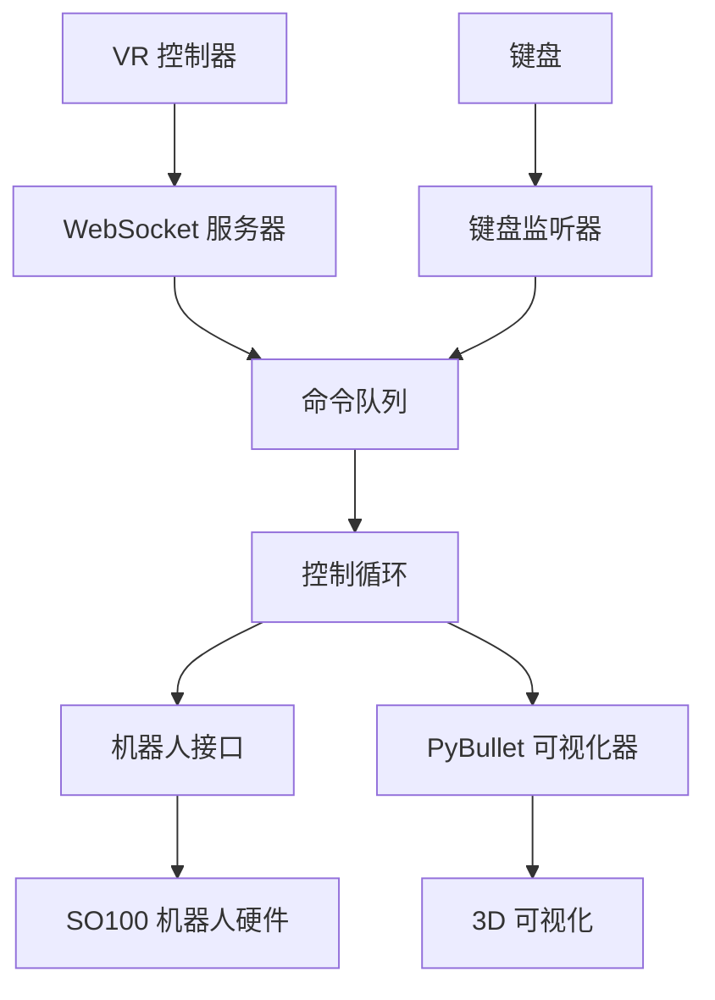

```bash
git add ./;git commit -m "头显控制";git push
```

```bash
git pull
```
```bash
git checkout 。/
```

```bash
ssh root@121.40.151.10
```
```bash
ssh gaoda@192.168.110.90
```
```bash
conda activate aider
```
```bash
pip install -e . -i https://pypi.tuna.tsinghua.edu.cn/simple
```

### 开发/测试模式

**仅可视化**（无机器人硬件）：
```bash
# 开发环境 - 连接本地
python -m telegrip.main --no-robot --server-host localhost
```
```bash
# 生产环境 - 连接线上
python -m telegrip.main --no-robot --server-host ws.houqicg.com
```

**仅键盘**（无 VR）：
```bash
python -m telegrip.main --no-vr
```

**无仿真**（无 PyBullet 仿真或逆运动学）：
```bash
python -m telegrip.main --no-sim
```

**无头模式**（无 PyBullet GUI）：
```bash
python -m telegrip.main --no-viz
```

**自动连接机器人**（跳过手动连接步骤）：
```bash
python -m telegrip.main --autoconnect
```
```bash
python main.py
```
```bash
python main.py --env-dev
```
# telegrip - SO100 机械臂遥操作系统

一个开源的 [SO100 机械臂](https://github.com/TheRobotStudio/SO-ARM100)遥操作系统，支持来自 VR 控制器或键盘的输入，具有共享逆运动学、3D 可视化和 Web UI。


*使用像 Meta Quest 这样的 VR 头显和内置的 WebXR 应用，控制器运动会流式传输到 telegrip 控制器，这样你就可以无需专用的主机械臂来记录训练数据。*

https://github.com/user-attachments/assets/e21168b5-e9b4-4c83-ab4d-a15cb470d11b


*使用 Quest 3 头显操作两个 SO-100 机械臂*


## 特性

- **统一架构**：单一入口点协调所有组件
- **多种输入方式**：VR 控制器（Quest/WebXR）和键盘控制
- **共享 IK/FK 逻辑**：基于 PyBullet 的双臂逆运动学和正运动学
- **实时可视化**：带有坐标系和标记的 3D PyBullet 可视化
- **安全功能**：关节限制钳位、优雅关闭和错误处理
- **异步/非阻塞**：所有组件并发运行而不阻塞

## 安装

### 前置条件

1. **机器人硬件**：一个或两个带有 USB-串行连接的 SO100 机械臂
2. **Python 环境**：Python 3.8+ 及所需包
3. **VR 设置**（可选）：支持 WebXR 的 Meta Quest 或其他头显（无需安装应用！）
4. **编译工具**：`pybullet` 和 `evdev` 包含 C/C++ 扩展，需要编译工具

   ```bash
   # 方式一：通过系统包管理器安装
   sudo apt-get install -y build-essential gcc g++

   # 方式二：通过 conda 安装（无需 sudo）
   conda install -c conda-forge gcc gxx -y
   ```


### 包安装

你必须首先按照官方说明手动安装 LeRobot：[https://github.com/huggingface/lerobot](https://github.com/huggingface/lerobot)。

遵循官方 LeRobot 安装指南：

```bash
# 克隆官方 LeRobot 仓库
git clone https://github.com/huggingface/lerobot.git
cd lerobot
# 按照他们的说明安装（通常）：
pip install -e .
```

安装 LeRobot 后，安装 telegrip（此包）：

```bash
# 以可编辑模式安装（推荐用于开发）
git clone https://github.com/DipFlip/telegrip.git
pip install -e .
```

如果自签名 SSL 证书（`cert.pem` 和 `key.pem`）不存在，系统将自动创建它们。

如果出于任何原因需要手动生成它们：

```bash
openssl req -x509 -newkey rsa:2048 -keyout key.pem -out cert.pem -sha256 -days 365 -nodes -subj "/C=US/ST=Test/L=Test/O=Test/OU=Test/CN=localhost"
```

## 使用方法

### 基本用法

运行完整的遥操作系统：

```bash
python -m telegrip.main
```
第一次运行时，你可能会被要求完成姿态校准，如[此指南](https://github.com/huggingface/lerobot/blob/8cfab3882480bdde38e42d93a9752de5ed42cae2/examples/10_use_so100.md#e-calibrate)所示。校准文件存储在 `.cache/calibration/so100/arm_name.json` 中。当找到校准文件时，你将看到类似以下消息：
```bash
🤖 telegrip 正在启动...
在浏览器中打开 UI：
https://192.168.7.233:8442
然后在你的 VR 头显浏览器中访问相同地址
```
点击或在浏览器中输入你的地址以显示 UI。从你的 VR 头显访问相同地址以进入 VR Web 应用。第一次你应该在设置菜单（右上角）中输入机器人臂端口信息。或者，你可以在此仓库根目录的 `config.yaml` 文件中手动输入详细信息。
一旦你看到机器人臂已找到（绿色指示器），你可以点击"连接机器人"并开始通过键盘或 VR 头显控制它。

### 命令行选项

```bash
python -m telegrip.main [选项]

选项：
  --no-robot        禁用机器人连接（仅可视化）
  --no-sim          禁用 PyBullet 仿真和逆运动学
  --no-viz          禁用 PyBullet 可视化（无头模式）
  --no-vr           禁用 VR WebSocket 服务器
  --no-keyboard     禁用键盘输入
  --autoconnect     启动时自动连接到机器人电机
  --log-level LEVEL 设置日志级别：debug, info, warning, error, critical（默认：warning）
  --https-port PORT HTTPS 服务器端口（默认：8442）
  --ws-port PORT    WebSocket 服务器端口（默认：8442）
  --host HOST       主机 IP 地址（默认：0.0.0.0）
  --urdf PATH       机器人 URDF 文件路径
  --left-port PORT  左臂串行端口（默认：/dev/ttySO100red）
  --right-port PORT 右臂串行端口（默认：/dev/ttySO100leader）
```


## 控制方法

### VR 控制器控制

1. **设置**：将 Meta Quest 连接到同一网络，导航到 `https://<your-ip>:8442`

2. **机械臂位置控制**：
   - **按住握把按钮**以激活该机械臂的位置控制
   - 按住握把时，机器人臂夹持器尖端将在 3D 空间中跟踪你的控制器位置
   - 释放握把按钮以停用位置控制

3. **手腕方向控制**：
   - 控制器的**滚动和俯仰**将与机械臂腕关节匹配
   - 这允许对末端执行器进行精确的方向控制

4. **夹持器控制**：
   - 按下并**按住触发按钮**以关闭夹持器
   - 只要你按住触发器，夹持器就保持关闭状态
   - 释放触发器以打开夹持器

5. **独立控制**：左右控制器独立控制各自的机器人臂 - 你可以同时操作双臂或一次操作一个

### 键盘控制

**左臂控制**：
   - **W/S**：前进/后退
   - **A/D**：左/右 
   - **Q/E**：下/上
   - **Z/X**：手腕滚动
   - **F**：切换夹持器开/关

**右臂控制**：
   - **I/K**：前进/后退
   - **J/L**：左/右
   - **U/O**：上/下
   - **N/M**：手腕滚动
   - **;（分号）**：切换夹持器开/关

## 架构

### 组件通信



### 控制流程

1. **输入提供者**（VR/键盘）生成 `ControlGoal` 消息
2. **命令队列**缓冲目标以供处理
3. **控制循环**消费目标并执行：
   - 将位置目标转换为 IK 解决方案
   - 使用安全钳位更新机器人臂角度
   - 向机器人硬件发送命令
   - 更新 3D 可视化
4. **机器人接口**管理硬件通信和安全

### 数据结构

**ControlGoal**：高级控制命令
```python
@dataclass
class ControlGoal:
    arm: Literal["left", "right"]           # 目标机械臂
    mode: ControlMode                       # POSITION_CONTROL 或 IDLE
    target_position: Optional[np.ndarray]   # 3D 位置（机器人坐标）
    wrist_roll_deg: Optional[float]         # 手腕滚动角度
    gripper_closed: Optional[bool]          # 夹持器状态
    metadata: Optional[Dict]                # 附加数据
```

## 配置

### 机器人配置

- **关节名称**：`["shoulder_pan", "shoulder_lift", "elbow_flex", "wrist_flex", "wrist_roll", "gripper"]`
- **IK 关节**：前 3 个关节用于位置控制
- **直接控制**：手腕滚动和夹持器直接控制
- **安全**：从 URDF 读取并强制执行关节限制

### 网络配置

- **HTTPS 端口**：8442（Web 界面）
- **WebSocket 端口**：8442（VR 控制器）  
- **主机**：0.0.0.0（所有接口）

### 坐标系

- **VR**：X=右，Y=上，Z=后（朝向用户）
- **机器人**：X=前，Y=左，Z=上
- **转换**：在运动学模块中自动处理

## 故障排除

### 常见问题

**机器人连接失败**：
- 检查 USB-串行设备权限：`sudo chmod 666 /dev/ttySO100*`
- 验证端口名称与实际设备匹配
- 尝试使用 `--no-robot` 进行测试

**VR 控制器未连接**：
- 确保 Quest 和机器人在同一网络上
- SSL 证书会自动生成，但如果问题持续存在，请检查 `cert.pem` 和 `key.pem` 是否存在
- 首先尝试直接在浏览器中访问 Web 界面
- 如果缺少 OpenSSL，请安装它：`sudo apt-get install openssl`（Ubuntu）或 `brew install openssl`（macOS）

**PyBullet 可视化问题**：
- 安装 PyBullet：`pip install pybullet`
- 尝试无头模式：`--no-viz`
- 检查 URDF 文件是否存在于指定路径

**键盘输入不起作用**：
- 以适当的权限运行以获取输入访问权限
- 检查终端是否具有焦点以获取按键事件
- 尝试 `--no-keyboard` 隔离问题

### 调试模式

**详细日志**：
```bash
python -m telegrip.main --log-level info    # 显示详细的启动和操作信息
python -m telegrip.main --log-level debug   # 显示最大详细信息以进行调试
```

**组件隔离**：
- 使用禁用标志测试各个组件
- 检查日志中的组件状态
- 验证队列通信

## 开发

### 添加新的输入方法

1. 创建继承自 `BaseInputProvider` 的新输入提供者
2. 实现 `start()`、`stop()` 和命令生成
3. 添加到 `TelegripSystem` 初始化
4. 通过命令行参数配置

### 扩展机器人接口

1. 向 `RobotInterface` 添加新方法
2. 如果需要，更新 `ControlGoal` 数据结构
3. 修改控制循环执行逻辑
4. 首先使用 `--no-robot` 模式测试

### 自定义可视化

1. 扩展 `PyBulletVisualizer` 类
2. 添加新的标记类型或坐标系
3. 更新控制循环中的可视化调用

## pink IK 求解器依赖 (test_openarm_pink_ik.py)

`test_openarm_pink_ik.py` 是基于 [pink](https://github.com/stephane-caron/pink) 的 OpenArmX 双臂逆运动学求解脚本，需要额外的依赖。

### 所需的库

| 包名 | 用途 | 安装方式 |
|---|---|---|
| `pinocchio` | 机器人建模与运动学 (C++库) | conda |
| `pin-pink` | pink IK 求解框架 (含 `pin`+`pink`) | pip (`--no-deps`) |
| `meshcat_shapes` | MeshCat 可视化辅助 (画坐标系) | pip |
| `qpsolvers` | 二次规划(QP)求解器封装 | pip |
| `quadprog` | QP 求解器后端 (脚本默认) | pip |
| `loop_rate_limiters` | 循环频率限制 | pip |

### Windows 安装步骤 (aider conda 环境)

> ⚠️ `pinocchio` 是 C++ 库，pip 安装需要 CMake + C++ 编译器，Windows 上请用 conda 安装。

```bash
# 1. 先通过 conda 安装 pinocchio (预编译, 无需编译工具)
conda install -c conda-forge pinocchio -y

# 2. pip 安装其他依赖
pip install meshcat_shapes qpsolvers loop_rate_limiters quadprog

# 3. 安装 pin-pink (跳过自带的 pin 依赖, 用 conda 的 pinocchio)
pip install pin-pink --no-deps
```

### Linux 安装步骤

```bash
pip install meshcat_shapes qpsolvers loop_rate_limiters quadprog pin-pink
```

### 运行

```bash
python test_openarm_pink_ik.py
```

> 💡 注意: 脚本中 URDF 路径需根据当前系统修改。默认路径对应 `C:/www/codeing/open_origin/openArmX/openarmx_mujoco/`。

## 安全注意事项

- **紧急停止**：按 Ctrl+C 进行优雅关闭
- **关节限制**：从 URDF 自动强制执行
- **初始位置**：机器人在关闭时返回安全位置
- **扭矩禁用**：在关闭序列期间电机关闭
- **错误处理**：如果非关键组件失败，系统继续运行

## 许可证

本项目采用 MIT 许可证 - 详见 [LICENSE](LICENSE) 文件。
