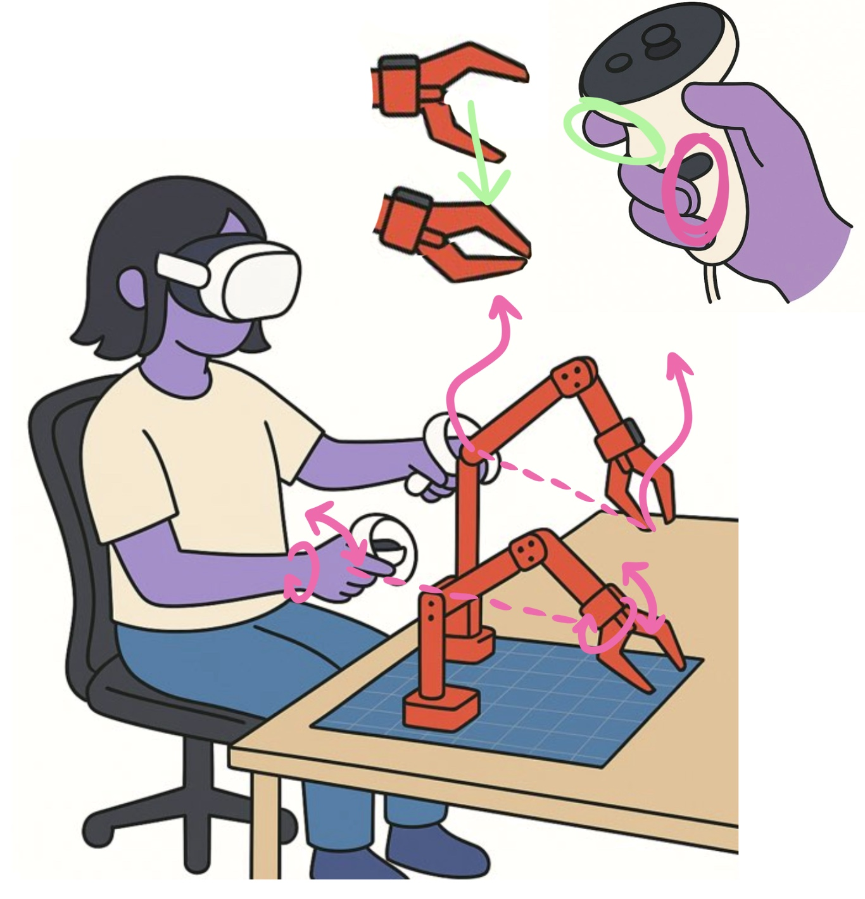
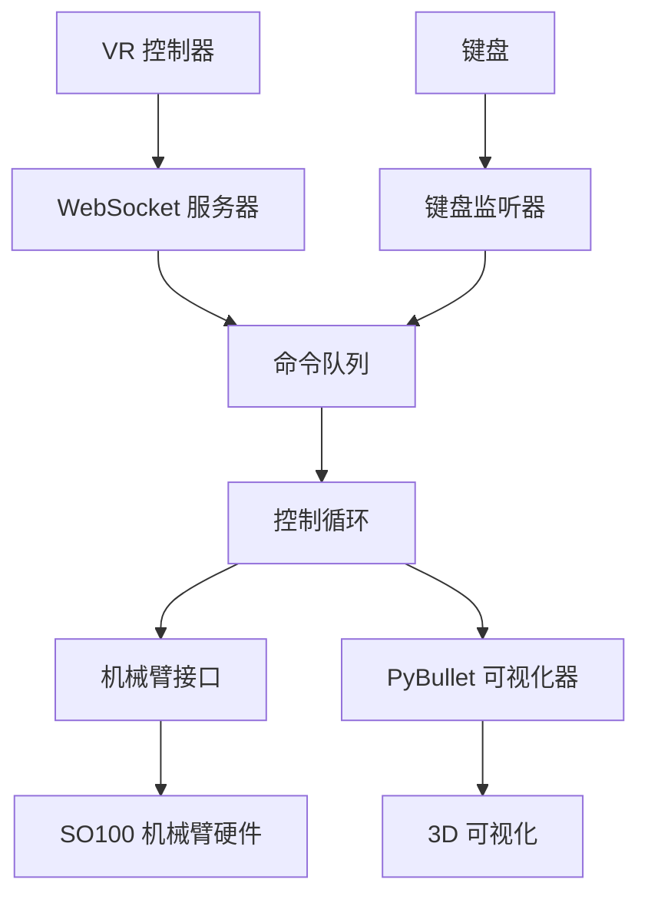

# telegrip - SO100 机械臂遥操作系统

一个开源的 [SO100 机械臂](https://github.com/TheRobotStudio/SO-ARM100) 遥操控制系统，支持 VR 手柄或键盘输入，具备共享逆运动学、3D 可视化和 Web 用户界面。



*使用 Meta Quest 等 VR 头显和内置的 WebXR 应用，将控制器动作流式传输到 telegrip 控制器，无需专用的主臂即可录制训练数据。*

https://github.com/user-attachments/assets/e21168b5-e9b4-4c83-ab4d-a15cb470d11b

*使用 Quest 3 头显操作两个 SO-100 机械臂*

## 功能特性

- **统一架构**: 单一入口点协调所有组件
- **多种输入方式**: VR 控制器（Quest/WebXR）和键盘控制
- **共享 IK/FK 逻辑**: 基于 PyBullet 的正逆运动学，支持双臂
- **实时可视化**: 3D PyBullet 可视化，包含坐标系和标记
- **安全特性**: 关节限位、优雅关闭和错误处理
- **异步非阻塞**: 所有组件并发运行，互不阻塞

## 安装

### 前置要求

1. **机器人硬件**: 一个或两个带 USB-串口连接的 SO100 机械臂
2. **Python 环境**: Python 3.8+ 及所需包
3. **VR 设置**（可选）: Meta Quest 或其他支持 WebXR 的头显（无需安装应用！）

### 包安装

首先必须按照官方说明手动安装 LeRobot：[https://github.com/huggingface/lerobot](https://github.com/huggingface/lerobot)

遵循官方 LeRobot 安装指南：

```bash
# 克隆官方 LeRobot 仓库
git clone https://github.com/huggingface/lerobot.git
cd lerobot
# 按照他们的说明安装（通常是）：
pip install -e .
```

安装 LeRobot 后，安装 telegrip（本包）：

```bash
# 以可编辑模式安装（推荐用于开发）
git clone https://github.com/DipFlip/telegrip.git
pip install -e .
```

系统会自动创建自签名 SSL 证书（`cert.pem` 和 `key.pem`），如果它们不存在的话。

如果需要手动生成证书：

```bash
openssl req -x509 -newkey rsa:2048 -keyout key.pem -out cert.pem -sha256 -days 365 -nodes -subj "/C=US/ST=Test/L=Test/O=Test/OU=Test/CN=localhost"
```

## 使用方法

### 基本用法

运行完整的遥操作系统：

开发环境启动时运行：
```bash
export ECS_WS_URL="wss://192.168.1.30:8442
#export ECS_WS_URL="wss://ws.houqicg.com"
python main.py

```

首次运行时，可能需要按照[此指南](https://github.com/huggingface/lerobot/blob/8cfab3882480bdde38e42d93a9752de5ed42cae2/examples/10_use_so100.md#e-calibrate)完成姿态校准。校准文件存储在 `.cache/calibration/so100/arm_name.json`。找到校准文件后，会显示类似以下消息：

```bash
🤖 telegrip 正在启动...
在浏览器中打开 UI：
https://192.168.7.233:8443
然后在 VR 头显浏览器中访问相同地址
```

在浏览器中点击或输入地址以显示 UI。从 VR 头显访问相同地址以进入 VR Web 应用。首次使用时，应在设置菜单（右上角）中输入机械臂端口信息。或者，也可以在此仓库根目录的 `config.yaml` 文件中手动输入详细信息。

看到机械臂已找到（绿色指示器）后，可以点击"连接机械臂"并开始通过键盘或 VR 头显进行控制。

### 命令行选项

```bash
telegrip [选项]

选项：
  --no-robot        禁用机械臂连接（仅可视化）
  --no-sim          禁用 PyBullet 仿真和逆运动学
  --no-viz          禁用 PyBullet 可视化（无头模式）
  --no-vr           禁用 VR WebSocket 服务器
  --no-keyboard     禁用键盘输入
  --autoconnect     启动时自动连接机械臂电机
  --log-level LEVEL 设置日志级别：debug, info, warning, error, critical（默认：warning）
  --https-port PORT HTTPS 服务器端口（默认：8443）
  --ws-port PORT    WebSocket 服务器端口（默认：8442）
  --host HOST       主机 IP 地址（默认：0.0.0.0）
  --urdf PATH       机器人 URDF 文件路径
  --left-port PORT  左臂串口号（默认：/dev/ttySO100red）
  --right-port PORT 右臂串口号（默认：/dev/ttySO100leader）
```

### 开发/测试模式

**仅可视化**（无机器人硬件）：
```bash
telegrip --no-robot
```

**仅键盘**（无 VR）：
```bash
telegrip --no-vr
```

**无仿真**（无 PyBullet 仿真或 IK）：
```bash
telegrip --no-sim
```

**无头模式**（无 PyBullet GUI）：
```bash
telegrip --no-viz
```

**自动连接机械臂**（跳过手动连接步骤）：
```bash
telegrip --autoconnect
```

## 控制方法

### VR 控制器控制

1. **设置**: 将 Meta Quest 连接到同一网络，导航至 `https://<你的IP>:8443`

2. **机械臂位置控制**: 
   - **按住握把按钮**激活该机械臂的位置控制
   - 按住握把时，机械臂夹爪尖端将在 3D 空间中跟踪你的控制器位置
   - 释放握把按钮停用位置控制

3. **腕部方向控制**:
   - 控制器的**滚转和俯仰**将与机械臂腕部关节匹配
   - 这允许精确控制末端执行器的方向

4. **夹爪控制**:
   - 按下并**按住触发按钮**关闭夹爪
   - 只要按住触发器，夹爪就保持关闭状态
   - 释放触发器打开夹爪

5. **独立控制**: 左右控制器分别控制各自的机械臂 - 可以同时操作两个机械臂或一次操作一个

### 键盘控制

**左臂控制**:
   - **W/S**: 前进/后退
   - **A/D**: 左/右 
   - **Q/E**: 下/上
   - **Z/X**: 腕部滚转
   - **F**: 切换夹爪开/关

**右臂控制**:
   - **I/K**: 前进/后退
   - **J/L**: 左/右
   - **U/O**: 上/下
   - **N/M**: 腕部滚转
   - **;（分号）**: 切换夹爪开/关

## 架构

### 组件通信



### 控制流程

1. **输入提供者**（VR/键盘）生成 `ControlGoal` 消息
2. **命令队列**缓冲目标以供处理
3. **控制循环**消费目标并执行：
   - 将位置目标转换为 IK 解
   - 使用安全限位更新机械臂角度
   - 向机械臂硬件发送命令
   - 更新 3D 可视化
4. **机械臂接口**管理硬件通信和安全

### 数据结构

**ControlGoal**: 高级控制命令
```python
@dataclass
class ControlGoal:
    arm: Literal["left", "right"]           # 目标机械臂
    mode: ControlMode                       # POSITION_CONTROL 或 IDLE
    target_position: Optional[np.ndarray]   # 3D 位置（机器人坐标）
    wrist_roll_deg: Optional[float]         # 腕部滚转角
    gripper_closed: Optional[bool]          # 夹爪状态
    metadata: Optional[Dict]                # 附加数据
```

## 配置

### 机械臂配置

- **关节名称**: `["shoulder_pan", "shoulder_lift", "elbow_flex", "wrist_flex", "wrist_roll", "gripper"]`
- **IK 关节**: 前 3 个关节用于位置控制
- **直接控制**: 腕部滚转和夹爪直接控制
- **安全**: 从 URDF 读取关节限位并强制执行

### 网络配置

- **HTTPS 端口**: 8443（Web 界面）
- **WebSocket 端口**: 8442（VR 控制器）  
- **主机**: 0.0.0.0（所有接口）

### 坐标系

- **VR**: X=右，Y=上，Z=后（朝向用户）
- **机器人**: X=前，Y=左，Z=上
- **转换**: 在运动学模块中自动处理

## 故障排除

### 常见问题

**机械臂连接失败**:
- 检查 USB-串口设备权限：`sudo chmod 666 /dev/ttySO100*`
- 验证端口名称与实际设备匹配
- 尝试使用 `--no-robot` 进行测试

**VR 控制器未连接**:
- 确保 Quest 和机器人在同一网络上
- SSL 证书自动生成，但如果问题持续，请检查 `cert.pem` 和 `key.pem` 是否存在
- 首先尝试在浏览器中直接访问 Web 界面
- 如果缺少 OpenSSL，请安装：`sudo apt-get install openssl`（Ubuntu）或 `brew install openssl`（macOS）

**PyBullet 可视化问题**:
- 安装 PyBullet：`pip install pybullet`
- 尝试无头模式：`--no-viz`
- 检查 URDF 文件是否存在于指定路径

**键盘输入不起作用**:
- 以适当的权限运行以获得输入访问
- 检查终端是否具有焦点以接收按键事件
- 尝试 `--no-keyboard` 隔离问题

### 调试模式

**详细日志**:
```bash
telegrip --log-level info    # 显示详细的启动和操作信息
telegrip --log-level debug   # 显示最大详细信息以进行调试
```
```bash
git add ./;git commit -m "update";git push
```
**组件隔离**:
- 使用禁用标志测试单个组件
- 在日志中检查组件状态
- 验证队列通信

## 开发

### 添加新输入方法

1. 创建继承自 `BaseInputProvider` 的新输入提供者
2. 实现 `start()`、`stop()` 和命令生成
3. 添加到 `TelegripSystem` 初始化
4. 通过命令行参数配置

### 扩展机械臂接口

1. 向 `RobotInterface` 添加新方法
2. 根据需要更新 `ControlGoal` 数据结构
3. 修改控制循环执行逻辑
4. 首先使用 `--no-robot` 模式测试

### 自定义可视化

1. 扩展 `PyBulletVisualizer` 类
2. 添加新标记类型或坐标系
3. 更新控制循环中的可视化调用

## 安全注意事项

- **紧急停止**: 按 Ctrl+C 进行优雅关闭
- **关节限位**: 从 URDF 自动强制执行
- **初始位置**: 关闭时机械臂返回安全位置
- **扭矩禁用**: 关闭序列期间禁用电机
- **错误处理**: 如果非关键组件失败，系统继续运行

## 许可证

本项目采用 MIT 许可证 - 详见 [LICENSE](LICENSE) 文件。
